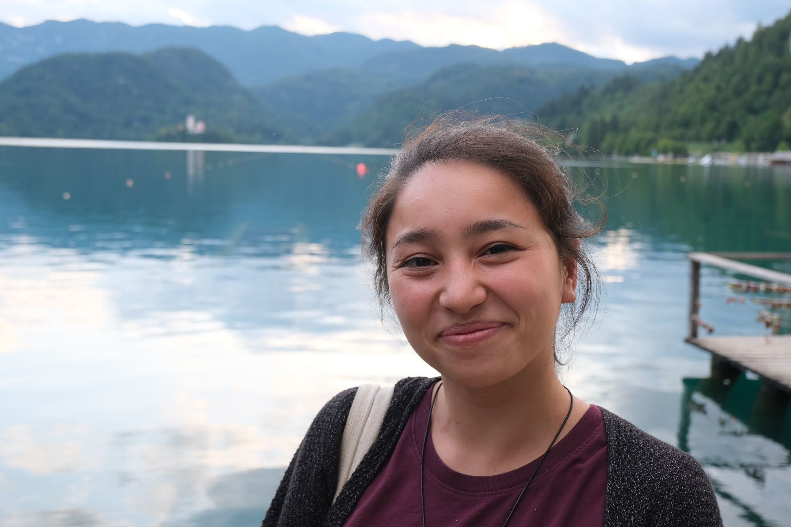

Hello!

My name is Rachel (she/her), and I am a Data Scientist and PhD student at Imperial College London in the [iCARE](https://imperialbrc.nihr.ac.uk/facilities/icare/) team. Before moving to London, I was a Healthcare Data Analyst at Fair Health, leveraging data science for transparency in American healthcare pricing. I received my MPH in Epidemiology from Columbia University in 2019, where I got to work on some very cool research on [air pollution and heart attack incidence](https://www.ncbi.nlm.nih.gov/pmc/articles/PMC10097537/). 

You can find out more about my professional background from my [resume](data/Rachel_Tao_Resume.pdf) or on [linkedin](https://www.linkedin.com/in/rachel-tao/).

I also like: knitting, plants, free jazz, local government, noodles, bike rides, and Yamiche Alcindor.

