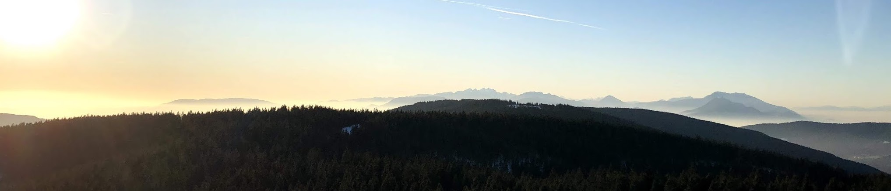

I am only as successful as the teams that I am working with, so here is a list of groups I am currently involved with, as well as organizations that have made an impact on me in the past:

[Costello Medical](https://www.costellomedical.com/) is a healthcare consulting firm working across healthcare, particularly with pharmaceutical companies in the area of Health Technology Assessment (HTA). As a Statistician at Costello, I work primarily on comparing efficacy and safety of drugs through meta-analysis and indirect treatment comparison (ITC), including network meta-analysis (NMA), matching-adjusted indirect treatment comparison (MAIC), simulated treatment comparison (STC) and other methodologies, using data from published literature and direct trial data. At Costello I have had the opportunity to train in newest methodologies in the industry, such multi-level network meta-regression (ML-NMR), and also to contribute to cutting-edge research on crossover adjustment in survival analysis.

[iCARE](https://imperialbrc.nihr.ac.uk/facilities/icare/) (Imperial Clinical Analytics, Research and Evaluation) is a team of researchers and data specialists at Imperial College London and Imperial College Healthcare NHS Trust who leverage routinely collected data in healthcare towards quality improvement in healthcare, health research, and public health.

[Fair Health](https://www.fairhealth.org/) is an independent nonprofit that manages the United States' largest database of privately billed health insurance claims. They create data products that represent the cost of healthcare in different parts of the United States. I worked as part of the Product Review team, performing data analytics on our data products to ensure that we are presenting our data accurately and correctly.

[makLab](https://marianthi.github.io/makLAB.github.io/index.html) is an environmental epidemiology lab led by Dr. Marianthi-Anna Kioumourtzoglou at Columbia University, focusing on methodological issues in environmental health sciences. My master's thesis on air pollution and myocardial infarction has been driven by work in this lab and through collaboration with the members of this team.

